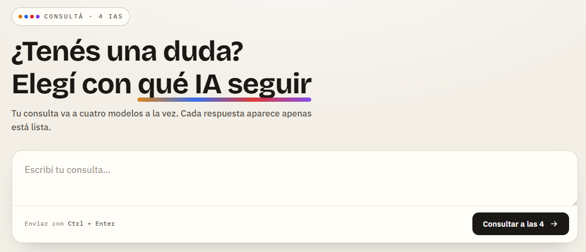

# Consultá a 4 IAs

Una web simple donde escribís una consulta, se envía **en paralelo a 4 modelos de IA distintos** (vía [OpenRouter](https://openrouter.ai)) y compará las respuestas lado a lado. Cada tarjeta se completa apenas su modelo responde, y podés elegir con cuál seguir charlando.

Todo corre sobre **n8n** autohospedado en Docker: n8n sirve la web *y* orquesta las llamadas a las IAs. No hace falta un backend aparte.

 <!-- opcional: agrega una captura -->

---

## Cómo funciona

- Un **webhook GET** (`/webhook/web`) sirve la página HTML.
- Un **webhook POST** (`/webhook/consulta`) recibe `{ pregunta, slug, nombre }`, llama a **un** modelo y devuelve su respuesta.
- La web dispara **4 llamadas en paralelo** (una por modelo), así la respuesta rápida aparece sin esperar a la lenta.

```
Navegador  --GET /webhook/web-->     n8n  (devuelve el HTML)
Navegador  --POST /webhook/consulta--> n8n --> OpenRouter --> IA   (x4 en paralelo)
```

---

## Requisitos

- [Docker](https://docs.docker.com/get-docker/) y Docker Compose.
- Una API key gratuita de OpenRouter: registrate en https://openrouter.ai y creá una key en **Settings → Keys**.

---

## Puesta en marcha

**1. Cloná el repo**
```bash
git clone https://github.com/TU_USUARIO/TU_REPO.git
cd TU_REPO
```

**2. Configurá tu API key**

Copiá la plantilla de variables de entorno y editá el archivo `.env` con tu key:
```bash
cp .env.example .env
```
Abrí `.env` y reemplazá el valor:
```
OPENROUTER_API_KEY=sk-or-v1-tu-key-real
```
> El archivo `.env` está en `.gitignore`, así que tu key nunca se sube a GitHub.

**3. Levantá n8n**
```bash
docker compose up -d
```
Esperá unos segundos y abrí http://localhost:5678. La primera vez n8n te pide crear un usuario local (es solo para tu instancia).

**4. Importá el workflow**

En n8n: menú **⋯ (arriba a la derecha) → Import from File** → elegí `workflows/web-4-ias.json`.

**5. Activá el workflow**

Con el workflow abierto, prendé el toggle **Active** (arriba a la derecha).

**6. Usá la web**

Abrí 👉 **http://localhost:5678/webhook/web**

Escribí una consulta y mirá cómo responden los 4 modelos. ✨

---

## Probar sin gastar API (modo demo)

Agregá `?demo=1` a la URL para ver la interfaz con respuestas simuladas (latencias dispares incluidas), sin llamar a OpenRouter:

```
http://localhost:5678/webhook/web?demo=1
```

---

## Cambiar los modelos

Los 4 modelos se configuran en **un solo lugar**: dentro del HTML (nodo Set "HTML"), al principio del `<script>`:

```js
var MODELOS = [
  { nombre:"GLM 4.5 Air", slug:"z-ai/glm-4.5-air:free", color:"#d97706", mono:"G", tag:"Z-AI" },
  // ...
];
```

Cambiá `slug` por cualquier modelo de OpenRouter. Para modelos gratis, filtrá por **Free** en https://openrouter.ai/models y copiá el slug (termina en `:free`).

> ⚠️ La lista de modelos free de OpenRouter rota seguido. Si un slug da error 404, reemplazalo por otro vigente del dashboard.

---

## Notas

- Los modelos `:free` tienen límites de uso (aprox. 20 req/min) y pueden tardar bastante en horario pico. Para un uso fluido, cargá unos créditos en OpenRouter y usá modelos pagos baratos.
- "Seguir con esta" abre el chat de OpenRouter con ese modelo cargado (requiere estar logueado en OpenRouter).
- Para exponer la web fuera de tu máquina, cambiá `WEBHOOK_URL` en `docker-compose.yml` por tu dominio público.

---

## Comandos útiles

```bash
docker compose up -d        # levantar
docker compose logs -f n8n  # ver logs
docker compose down         # detener (conserva datos)
docker compose down -v      # detener y BORRAR todos los datos de n8n
```

---

## Licencia

MIT
